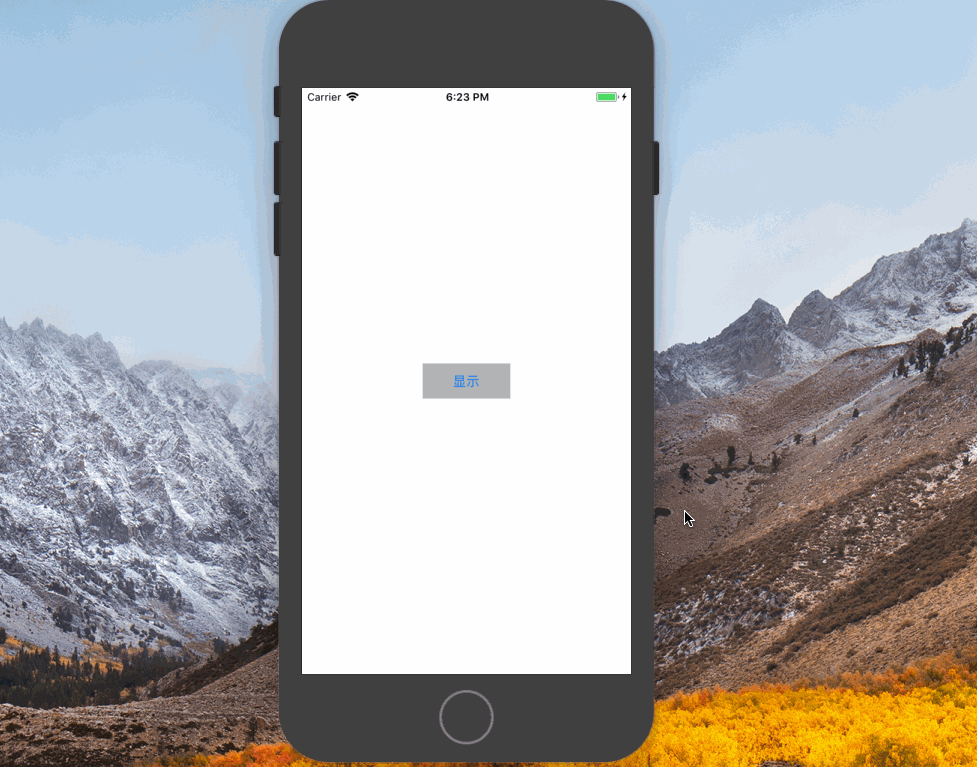

# QDNotificationBar
只需一行代码即可：
- 自定义横幅的图标、标题、时间、内容、动画时间
- 自定义弹出时的声音，可选用系统提示音，或者自己添加声音文件

- 完全自定义弹出的 view
- 自定义 view 在竖屏时支持分别从三个方向弹出（屏幕上、左、右）

## 效果


### 自定义样式：

  


## 安装

### pod 安装

    target 'YourTargetName' do
      pod 'QDNotificationBar'
    end


## 使用

### 自定义样式

---

```objc
#import <QDNotificationBar.h>
```


#### 构造并稍后展示：

```objc
UIView *view = ...;//需要展示的某个 view

//1.传入 view，并构造必要的参数
QDNotificationBar *bar = [QDNotificationBar makeNotificationBarWithCustomView:view block:^(QDNBMaker *make) {
        make.barFrame = CGRectMake(0, 100, size.width, 94);
        make.soundId = 1312;
        make.stayDuration = 0;
        make.appearMode = QDNotificationBarAppearModeRight;
        make.animationDuration = 0.5;
}];

//2.展示
[bar show];
//[bar hide];
```


##### 参数说明：

- `barFrame`：默认值 view.frame，类型 CGRect
- `soundID`：播放的提示音（静音时会自动振动），类型 UInt32
  - 该参数是 iOS 系统自带的声音 id，默认使用的是`三全音`，id = 1312
  - 其他系统声音 id 可以在这里查询到 [iOS Predefined sounds](http://iphonedevwiki.net/index.php/AudioServices#) 备用地址 [AudioServices sounds](http://www.cocoachina.com/bbs/read.php?tid=134344)
- `soundName`：播放自定义的声音文件，类型 NSString
  - 直接将声音文件拖拽到工程目录
  - 赋值时包含拓展名，例 sound.mp3
- `animationDuration`：显示/隐藏动画时间，类型 NSTimeInterval
- `stayDuration`：隐藏之前停留显示的时间，类型 NSTimeInterval
- `appearMode`：自定义view 出现的方向，上/左/右，默认值 Top，类型 enum

